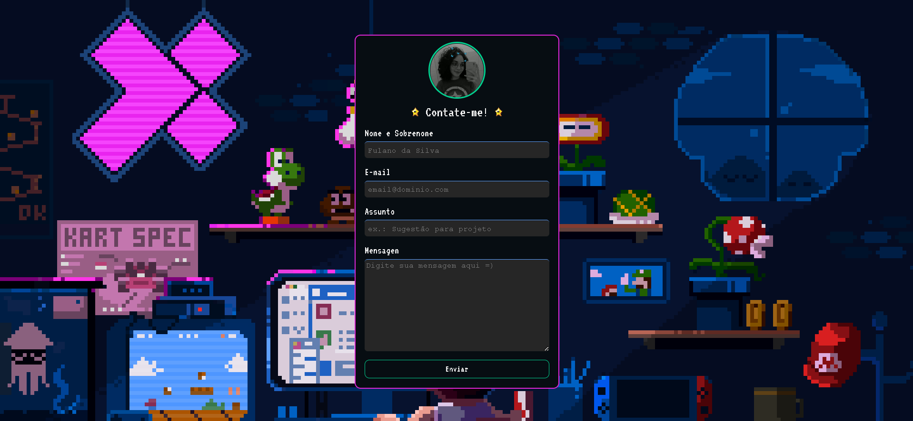

# [Validação de Formulário](https://amandavsadev.github.io/formValidacao-JS/) | HTML, CSS e JavaScript.

## :page_facing_up: Sobre o Projeto
- A intenção inicial do projeto é criar uma ponte para que as pessoas possam me contatar de forma mais rápida através do e-mail, além de colocar em prática meus conhecimentos em JavaScript.
- O projeto foi baseado no meu portfólio, vocês podem encontrá-lo <a href="https://github.com/amandavsadev/mini-portfolio">clicando aqui</a>.
---
## :framed_picture: Imagem do Projeto

---
## Tecnologias utilizadas
  * [HTML](https://developer.mozilla.org/pt-BR/docs/Web/HTML) 
  * [CSS](https://developer.mozilla.org/pt-BR/docs/Web/CSS)
  * [JavaScript](https://developer.mozilla.org/pt-BR/docs/Web/JavaScript)
---
## :man_technologist:  Autor

<table class="author">
  <tr>
    <td align="center">
      <a href="https://github.com/amandavsadev">
        
         
        
          <b>Amanda Amorim</b>
        
      </a>
    </td>
  </tr>
</table>   
   Linkedin:
   https://www.linkedin.com/in/amandavsamorim/
   
   E-mail: amandavsadev@gmail.com
   
  ## 📝 Licença

   O projeto o possui a licença _MIT_, veja o arquivo [LICENÇA](license) para mais informações.
